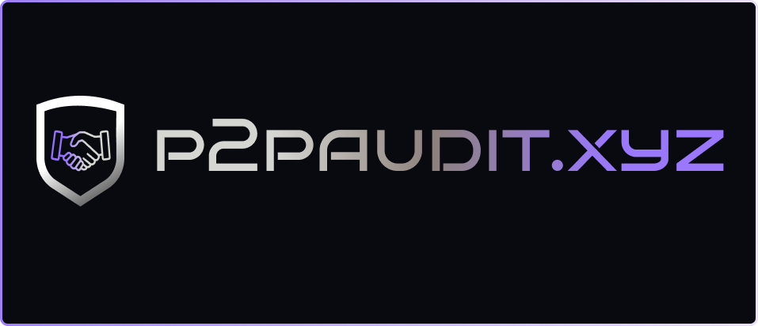

## About P2PAudits
P2P Audit, we source top talent from across the web3 ecosystem to put together the best team possible for your project, unlike traditional auditing organizations that employ teams of full-time security experts.

We understand that your project may have unique requirements and timelines, and we are flexible in accommodating your needs. Our goal is to work with you to ensure the security and reliability of your smart contracts, so you can focus on the growth and success of your project.

### P2PAuditKatana
The Auditkatana bot is an advanced AI-integrated tool that surpasses all other automated tools in the market, boasting an exceptional track record of zero false positives issues. Its primary objective is to assist in the identification of over 100 smart contract bugs and gas optimization issues. Additionally, the bot offers valuable suggestions to enhance the security of the code, ensuring its robustness and reliability. With its cutting-edge capabilities, the Auditkatana bot is revolutionizing the field of smart contract auditing, providing unparalleled accuracy and efficiency.

---

# Audit_Reports

| Serial No. | Date      | Project Name  | Audit Report | 
|------------|-----------|---------------|--------------|
| 001.       | May, 2023 | [Kunji Finance](https://www.kunji.finance/) |      [Link](https://www.p2paudit.xyz/reports/001-Kunji-Finance)        |
| 002.       | June, 2023 | [EtherVerse Token](https://www.etherverse.in/) |      [Link](https://www.p2paudit.xyz/reports/002-EtherVerse-Token)  
